# Cyclistic Bike-share Analysis

This capstone project is the final part of the [Google Data Analytics Certificate](https://www.coursera.org/professional-certificates/google-data-analytics) on Cousera. The main objective of this project is for me to demonstrate the skills acquired throughout the course and apply them to real-world scenarios. As a junior data analyst within the marketing analyst team of Cyclistic, a fictional bike-share company, I will go through 6 phases of the data analysis process in this project including **Ask, Prepare, Process, Analyze and Act.** 


## Table of contents
- [STEP 1: ASK](#Step-1-ask)
    - [1.1 Background](#11-background)
    - [1.2 Business Task](#12-business-task)
    - [1.3 Deliverables](#13-deliverables)
    - [1.4 Key Stakeholders](#14-key-stakeholders)
- [STEP 2: PREPARE](#step-2-prepare)
- [STEP 3: PROCESS](#step-3-process)
    - [3.1 Choosing tools](#31-choosing-tools)
    - [3.2 Preparing the environment](#32-preparing-the-environment)
    - [3.3 Data cleaning and manipulation](#33-data-cleaning-and-manipulation)
- [STEP 4: ANALYZE](#step-4-analyze)
    - [4.1 Running calculations](#41-running-calculations)
- [STEP 5: SHARE](#step-5-share)
- [STEP 6: ACT](#step-6-act)

*Quick Link:* [Github R Code](https://github.com/alitanguyen/Cyclistic-bike-share-analysis/tree/main)
    
## **STEP 1: ASK**

### **1.1 Background**

In 2016, Cyclistic launched a successful bike-share offering. Since then, the program has grown to a  fleet of 5,824 bicycles that are geotracked and locked into a network of 692 stations across Chicago. The bikes can be unlocked from one station and returned to any other station in the system anytime.

The director of marketing, Lily Moreno, believes the company’s future success depends on maximizing the number of annual memberships. Moreno believes that targeting casual riders are the key because they are already aware of the Cyclistic program and have chosen Cyclistic for their mobility needs. Therefore, our team wants to understand how casual riders and annual members use Cyclistic bikes differently. From these insights, we will design a new marketing strategy to convert casual riders into annual members. 

### **1.2 Business Task**

How do annual members and casual riders use Cyclistic bikes differently?

### **1.3 Deliverables**

1. A clear summary of the business task
2. A description of all data sources used
3. Documentation of any cleaning or manipulation of data
4. A summary of analysis
5. Supporting visualizations and key findings
6. Top three recommendations based on the analysis

### **1.4 Key Stakeholders**

1. Lily Moreno: Director of marketing and my manager who is responsible for the development of campaigns and initiatives to promote the bike-share program.
2. Cyclistic marketing analytics team: A team of data analysts who are responsible for collecting, analyzing, and reporting data.
3. Cyclistic executive team: Detail-oriented executive team will decide whether to approve the recommended marketing program.

## **STEP 2: PREPARE**

1. The data is publicly available **[here](https://divvy-tripdata.s3.amazonaws.com/index.html)** under the **[license](https://ride.divvybikes.com/data-license-agreement)** by Motivate International Inc. It is stored in .csv files. 
2. I downloaded the last 12 months of Cyclistic trip data from February 2023 to January 2024 for this project. 
3. The data meets the criteria for ROCCC: **R**eliable, **O**riginal, **C**omprehensive, **C**urrent, and **C**ited and there are no issues with bias or credibility. 

## **STEP 3: PROCESS**

### **3.1. Choosing tools**

I used R Studio to process the data.

I also found out that I could not use Excel spreadsheet or Google spreadsheet to process a dataset of **5,674,449** rows after combing all .csv files together. Because Excel spreadsheet has a limit of 1,048,576 rows and 16,384 columns while Google spreadsheet can only process maximum 18,278 columns and 40,000 rows. 

### **3.2. Preparing the environment**

1. Loaded needed libraries.

```r
library(tidyverse)
library(lubridate)
library(ggplot2)
```

2. Set my working directory and imported 12 .csv files to the environment then assigned each monthly .csv file to its own variable. 

```r
setwd('/Users/9360/Desktop/Data Analytics/Google_Data_Analytics/Capstone_Project/Data')
Feb2023_df <- read.csv("202302-divvy-tripdata.csv")
Mar2023_df <- read.csv("202303-divvy-tripdata.csv")
Apr2023_df <- read.csv("202304-divvy-tripdata.csv")
May2023_df <- read.csv("202305-divvy-tripdata.csv")
Jun2023_df <- read.csv("202306-divvy-tripdata.csv")
Jul2023_df <- read.csv("202307-divvy-tripdata.csv")
Aug2023_df <- read.csv("202308-divvy-tripdata.csv")
Sep2023_df <- read.csv("202309-divvy-tripdata.csv")
Oct2023_df <- read.csv("202310-divvy-tripdata.csv")
Nov2023_df <- read.csv("202311-divvy-tripdata.csv")
Dec2023_df <- read.csv("202312-divvy-tripdata.csv")
Jan2024_df <- read.csv("202401-divvy-tripdata.csv")
```

3. Merge all uploaded files into a new data frame named `merged_df`.

```r
merged_df <- rbind(Feb2023_df, Mar2023_df, Apr2023_df, May2023_df, Jun2023_df, Jul2023_df, Aug2023_df, Sep2023_df, Oct2023_df, Nov2023_df, Dec2023_df, Jan2024_df)
```

4. Removed 12 .csv files to keep the environment organized.

```r
rm(Feb2023_df, Mar2023_df, Apr2023_df, May2023_df, Jun2023_df, Jul2023_df, Aug2023_df, Sep2023_df, Oct2023_df, Nov2023_df, Dec2023_df, Jan2024_df)
```

5. Saved the data frame as `merged_data` and got an overview of it

```r
merged_data <- merged_df
glimpse(merged_data)
```
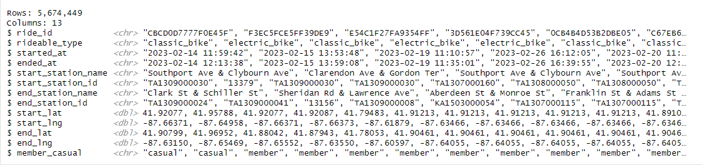

There are *13 variables* and *5,674,449 observations* in total. 

### **3.3 Data cleaning and manipulation**

**Data Cleaning** 

The following data cleaning was performed: 

1. Remove duplicate rows. 

```r
merged_data <- distinct(merged_data)
```

2. Remove NA values. 

```r
merged_data <- na.omit(merged_data)
```

3. Remove rows that has white space or empty string. 

```r
merged_data <- merged_data[rowSums(sapply(merged_data, function(x) x == "")) == 0, ]
```

4. Remove 7 unnecessary columns including ride_id, start_station_id, end_station_id, start_lat, start_lng, end_lat, end_lng.

```r
merged_data <- subset(merged_data, select = -c(ride_id, start_station_id, end_station_id, start_lat, start_lng, end_lat, end_lng))
```

At the beginning, I encountered difficulties due to the presence of white spaces and empty strings in the data frame. It took me a while to revisit this step and clean the data more carefully. As a result, the total number of rows decreased by 24%, amounting to 1,370,067 rows. Despite the removal of nearly one fourth of the data, the data frame still contained 4 million rows, providing enough data for calculations and visualizations in the next step. 

5. Save the data frame as `cleaned_data` and get an overview of it.

```r
cleaned_data <- merged_data
View(cleaned_data)
```

**Data Manipulation** 

The following data manipulation was performed:

1. Create new column `Ride_length` that calculates the length of each ride by subtracting `started_at` column from `ended_at` column and converts it into minutes.

```r
# create the column
cleaned_data$ride_length <- difftime(cleaned_data$ended_at, cleaned_data$started_at, units = 'min')
cleaned_data$ride_length <- as.numeric(cleaned_data$ride_length) 

# check the first 5 rows
head(cleaned_data, 5)
```

2. Create new column `Day_of_week` that extracts the day of the week from `started_at` column. It returns the day of the week in the form as ”Sunday”, “Monday”, etc. 

```r
# create the column
cleaned_data$day_of_week <- wday(cleaned_data$started_at, label = TRUE, abbr = FALSE)

# check the first 5 rows
head(cleaned_data, 5)
```

3. Create new column `Month` that extracts the month from `started_at` column. It returns the month in each year, starting from 1, ending at 12. 

```r
# create the column
cleaned_data$month <- format(as.Date(cleaned_data$started_at), "%m")

# check the first 5 rows
head(cleaned_data, 5)
```

4. Create new column `Day` that extracts the day from `started_at` column. It returns the day number in each month, starting from 1, ending at 31. 

```r
# create the column
cleaned_data$day <- format(as.Date(cleaned_data$started_at), "%d")

# check the first 5 rows
head(cleaned_data, 5)
```

5. Create new column `Hour` that extracts the hour from `started_at` column. It returns the hour of each day, starting from 0, ending at 23. 

```r
# create the column
cleaned_data$hour <- format(as.POSIXct(cleaned_data$started_at), format = "%H")

# check the first 5 rows
head(cleaned_data, 5)
```

6. Create new column `Round_trip` that identifies whether the route is one-way or round-trip by comparing the value of  `start_station_name` column and `end_station_name` column. If the start and end station names are the same, it indicates a round-trip route, and the value for the `Round_trip` column will be 'Yes'. In contrast, if the start and end station names are different, it indicates a one-way route, and the value for the `Round_trip` column will be 'No'.

```r
# create the column
cleaned_data$round_trip <- ifelse(cleaned_data$start_station_name == cleaned_data$end_station_name, 'Yes', 'No')

# check the first 5 rows
head(cleaned_data, 5)
```

Once I viewed new data frame, I found out that there are some negative rows in `ride_length`  column. It means that the ending time is before the starting time which is not appropriate. Those rows should also be removed. 

```r
cleaned_data <- cleaned_data %>%
  filter(ride_length >= 0)  
```

Saved the the data frame as `final_data`. 

```r
final_data <- cleaned_data
```

This data frame had **4,297,164 rows** indicating the removal of 1,377,285 rows. 

Data cleaning and manipulation is completed. Data is now ready to be analyzed.  

## **STEP 4: ANALYZE**

### **4.1 Running calculations**

1. Total number of rides and Average ride length.

```r
final_data %>%
 summarize(total_rides = nrow(final_data),average_ride_length = round(mean(ride_length), digits = 2))
```

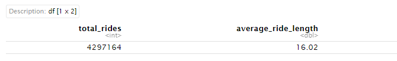


2. Total number of rides and Average ride length by User Type. 

```r
final_data %>%
group_by(member_casual) %>%
summarise(total_rides = length(member_casual),
percentage = round((length(member_casual) / nrow(final_data)) * 100, digits = 2),
average_ride_length = round(mean(ride_length), digits = 2))
```

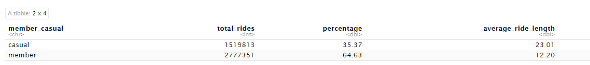

3. Total number of rides and Average ride length by Rideable Type and User Type. 

```r
final_data %>%
  group_by(member_casual, rideable_type) %>%
  summarise(total_rides = length(member_casual),
            percentage = round((length(rideable_type) / nrow(new_cleaned_data)) * 100, digits = 2),
            average_ride_length = round(mean(ride_length), digits = 2))
```

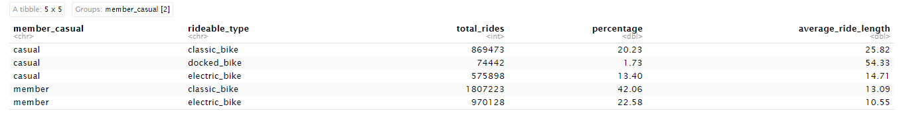

Findings after a few calculations: 

- Members accounted for a larger share of the total rides, at 64.6%.
- The average ride length for members was 12.2 minutes which was significantly shorter than that of casual riders (23.0 minutes) and the overall average ride length (16.02 minutes).
- The most popular bike among all users was classic.
- Member users were the predominant users of both electric and classic bikes, while docked bikes were not significantly used by either type of user.

## **STEP 5: SHARE**

**Analysis of Total Rides and Average Ride Length monthly** 

```r
final_data %>%
  group_by(member_casual, month) %>% 
  summarize(number_of_ride = n()) %>% 

ggplot(aes(month, number_of_ride, fill = member_casual)) +
  geom_bar(stat = "identity", position = position_dodge(preserve = 'single'), width = 0.7) +
  facet_wrap(~ member_casual) + 
  geom_text(aes(label = format(number_of_ride, big.mark = ",")), position = position_dodge(width = 0.7), hjust = -0.1, size = 2.0) + 
  
  labs(x = "Month", y = "Number of Rides", 
       title = "Cyclistic - Total Rides (Feb 2023 - Jan 2024)", 
       subtitle =  "By Month and User Type") +
  scale_fill_manual(values = c("#de6e56","#0b3c5d")) +
  scale_y_continuous(labels = scales::comma_format(), limits = c(0, 550000)) +
  theme_classic(base_size = 10) +
  coord_flip()

ggsave("Total_Rides_by_Month_and_User_Type.png", plot = last_plot(), dpi = 600)
```
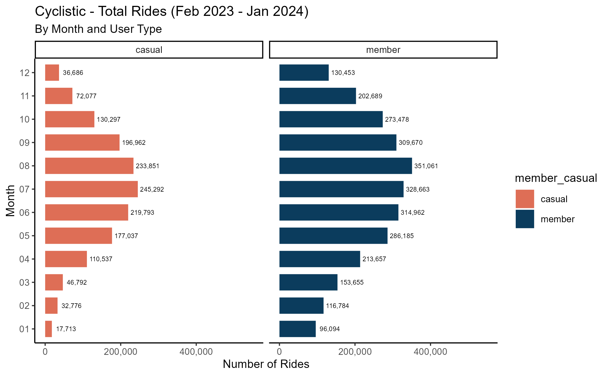

As can be seen from the graph: 

- Member usage consistently exceeded casual usage at every point throughout the year.
- The low season for both user types occurred from December to February of the following year, while the high season was from May to October.
- The smallest gap between casual and member rides was in the summer months, which could mean that pleasant weather conditions attract more casual riders. While the biggest gap was in the colder months, potentially indicating that casual riders were far more affected by seasonal changes than members.

```r
final_data %>%
  group_by(member_casual, month) %>% 
  summarize(average_ride_length = round(mean(ride_length), digits = 2))%>% 
  
ggplot(aes(month,average_ride_length, fill = member_casual)) +
  geom_bar(stat = "identity", position = position_dodge(preserve = 'single'), width = 0.7) +
  facet_wrap(~ member_casual) + 
  geom_text(aes(label = format(average_ride_length, big.mark = ",")), position = position_dodge(width = 0.7), hjust = -0.1, size = 2.0) + 
  
  labs(x = "Month", y = "Average Ride Length (min)", 
       title = "Cyclistic - Average Ride Length (Feb 2023 - Jan 2024)", 
       subtitle =  "By Month and User Type") +
  scale_fill_manual(values = c("#de6e56","#0b3c5d")) +
  scale_y_continuous(labels = scales::comma_format(), limits = c(0,30)) +
  theme_classic(base_size = 10) + 
  coord_flip()

ggsave("Average_Ride_Length_by_Month_and_User_Type.png", plot = last_plot(), dpi = 600)
```

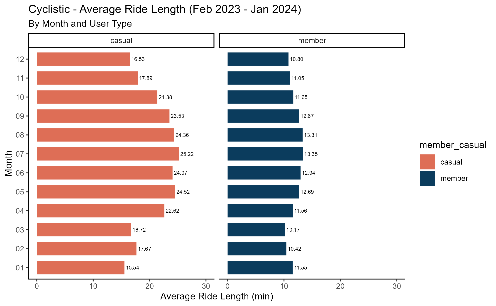

The graph showed that: 

- Casual riders consistently had longer average ride lengths with significant fluctuations throughout the year compared to members.
- The gap between the average ride length of casual and member riders narrowed slightly during summer months. It may indicate that members took longer rides in better weather condition, which was similar to casuals, but to a lesser extent.

**Analysis of Total Rides and Average Ride Length weekly**

```r
final_data %>%
  group_by(member_casual, day_of_week) %>% 
  summarize(number_of_ride = n()) %>% 

ggplot(aes(factor(day_of_week,levels = c("Sunday", "Saturday", "Friday", "Thursday", "Wednesday", "Tuesday", "Monday")), number_of_ride, fill = member_casual)) +
  geom_bar(stat = "identity", position = position_dodge(preserve = 'single'), width = 0.7) +
  facet_wrap(~ member_casual) + 
  geom_text(aes(label = format(number_of_ride, big.mark = ",")), position = position_dodge(width = 0.7), hjust = -0.1, size = 2.0) + 
  
  labs(x = "Day of week", y = "Number of Rides", 
       title = "Cyclistic - Total Rides (Feb 2023 - Jan 2024)", 
       subtitle =  "By Day of Week and User Type") +
  scale_fill_manual(values = c("#de6e56","#0b3c5d")) +
  scale_y_continuous(labels = scales::comma_format(), limits = c(0, 550000)) +
  theme_classic(base_size = 10) +
  coord_flip()

ggsave("Total_Rides_by_Day_of_the_Week_and_User_Type.png", plot = last_plot(), dpi = 600)
```

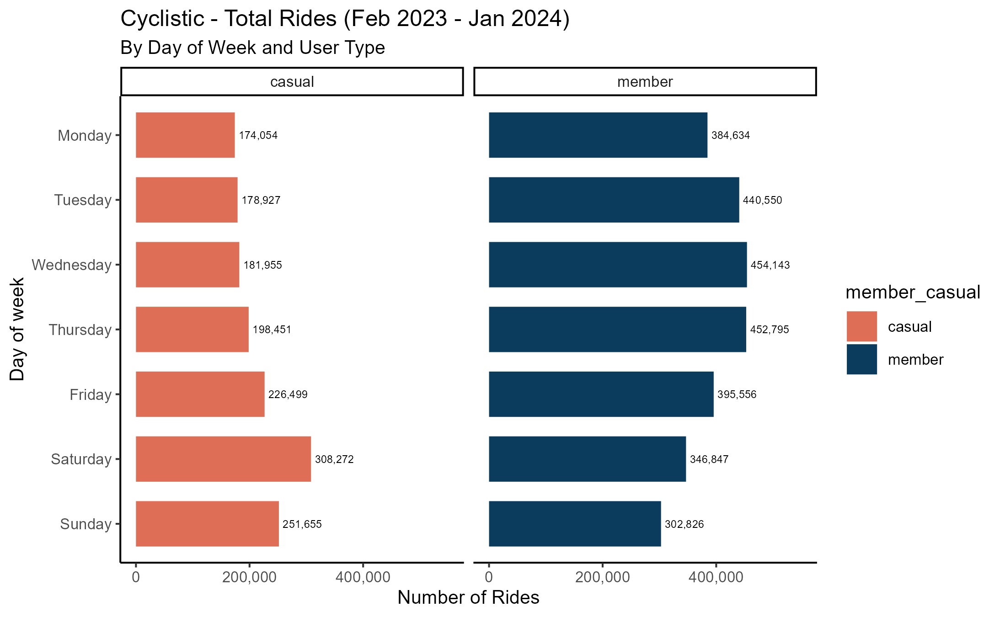


Overall, member users consistently outnumbered casual users in total rides, with the narrowest gap on Saturdays. Members tended to be more active on weekdays while casual users used the bikes more frequently on weekends.

```r
final_data %>%
  group_by(member_casual, day_of_week) %>% 
  summarize(average_ride_length = round(mean(ride_length), digits = 2))%>% 
  
ggplot(aes(factor(day_of_week,levels = c("Sunday","Saturday", "Friday","Thursday","Wednesday","Tuesday","Monday")),average_ride_length, fill = member_casual)) +
  geom_bar(stat = "identity", position = position_dodge(preserve = 'single'), width = 0.7) +
  facet_wrap(~ member_casual) + 
  geom_text(aes(label = format(average_ride_length, big.mark = ",")), position = position_dodge(width = 0.7), hjust = -0.1, size = 2.0) + 
  
  labs(x = "Day of week", y = "Average Ride Length (min)", 
       title = "Cyclistic - Average Ride Length (Feb 2023 - Jan 2024)", 
       subtitle =  "By Day of Week and User Type") +
  scale_fill_manual(values = c("#de6e56","#0b3c5d")) +
  scale_y_continuous(labels = scales::comma_format(), limits = c(0,30)) +
  theme_classic(base_size = 10) + 
  coord_flip()

ggsave("Average_Ride_Length_by_Day_of_the_Week_and_User_Type.png", plot = last_plot(), dpi = 600)
```
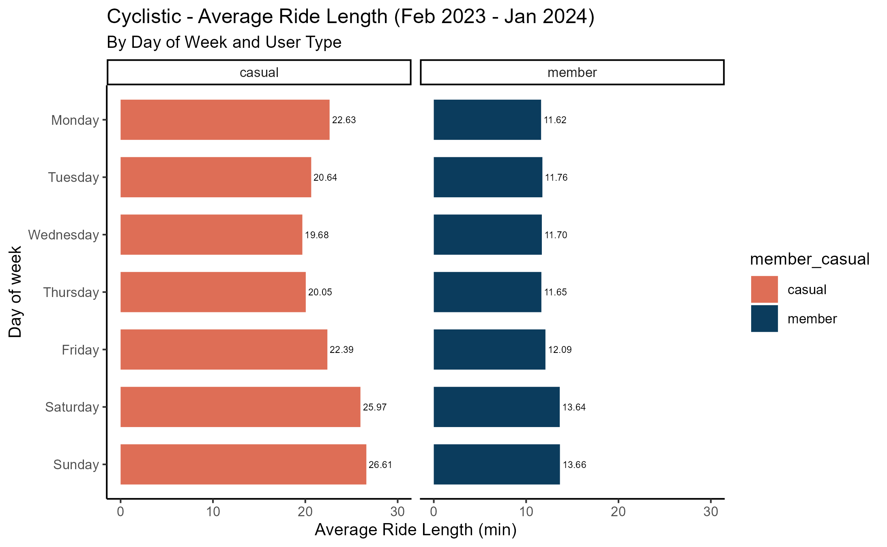

As shown in the graph: 

- The difference between the day with the highest and lowest number of rides was particularly pronounced among casual riders.
- Both types had their longest average ride on the weekends.
    - For casual users, Sunday recorded the longest average ride at 26.61 minutes. Although Saturday had more riders than Sunday, the average ride length on Saturday was shorter than on Sunday.
    - For member users, Sunday also had the longest average ride at 13.66 minutes. Even though Saturday had higher total rides than Sunday, the average ride length for both days was quite similar.

**Analysis of Total Rides and Average Ride Length daily**

```r
final_data %>%
  group_by(member_casual, hour) %>% 
  summarize(number_of_ride = n()) %>% 

ggplot(aes(hour, number_of_ride, fill = member_casual)) +
  geom_bar(stat = "identity", position = position_dodge(preserve = 'single'), width = 0.7) +
  facet_wrap(~ member_casual) + 
  geom_text(aes(label = format(number_of_ride, big.mark = ",")), position = position_dodge(width = 0.7), hjust = -0.1, size = 2.0) + 
  
  labs(x = "Hour", y = "Number of Rides", 
       title = "Cyclistic - Total Rides (Feb 2023 - Jan 2024)", 
       subtitle =  "By Hour and User Type") +
  scale_fill_manual(values = c("#de6e56","#0b3c5d")) +
  scale_y_continuous(labels = scales::comma_format(), limits = c(0, 350000)) +
  theme_classic(base_size = 10) +
  coord_flip()

ggsave("Total_Rides_by_Hour_and_User_Type.png", plot = last_plot(), dpi = 600)
```

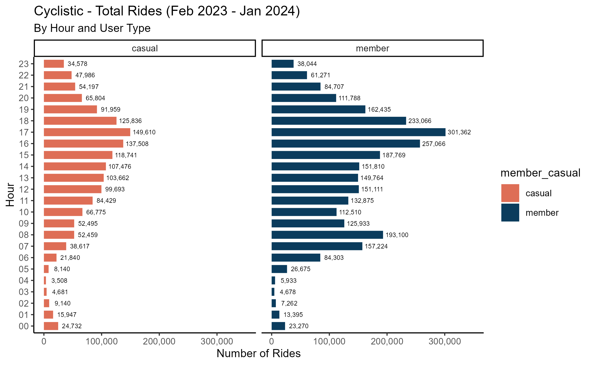

According to the graph:

- The total rides of member riders consistently outnumbered casual riders throughout most hours of the day.
- Both types had similar pattern of peak hours which were between 4 PM and 6 PM. They also experienced a significant drop in total rides during the nighttime hours.
- Casual rides were more evenly distributed across the midday to evening hours. Their number of rides increased steadily from 10 AM till the afternoon, peaking at 5 PM.
- Member riders experienced peak hours in the early morning from 7 AM to 8 AM and from late afternoon to early evening (4 - 6 PM), which likely correspond to typical commuting times.

```r
final_data %>%
  group_by(member_casual, hour) %>% 
  summarize(average_ride_length = round(mean(ride_length), digits = 2))%>% 
  
ggplot(aes(hour,average_ride_length, fill = member_casual)) +
  geom_bar(stat = "identity", position = position_dodge(preserve = 'single'), width = 0.7) +
  facet_wrap(~ member_casual) + 
  geom_text(aes(label = format(average_ride_length, big.mark = ",")), position = position_dodge(width = 0.7), hjust = -0.1, size = 2.0) + 
  
  labs(x = "Hour", y = "Average Ride Length (min)", 
       title = "Cyclistic - Average Ride Length (Feb 2023 - Jan 2024)", 
       subtitle =  "By Hour and User Type") +
  scale_fill_manual(values = c("#de6e56","#0b3c5d")) +
  scale_y_continuous(labels = scales::comma_format(), limits = c(0,30)) +
  theme_classic(base_size = 10) + 
  coord_flip()

ggsave("Average_Ride_Length_by_Hour_and_User_Type.png", plot = last_plot(), dpi = 600)
```

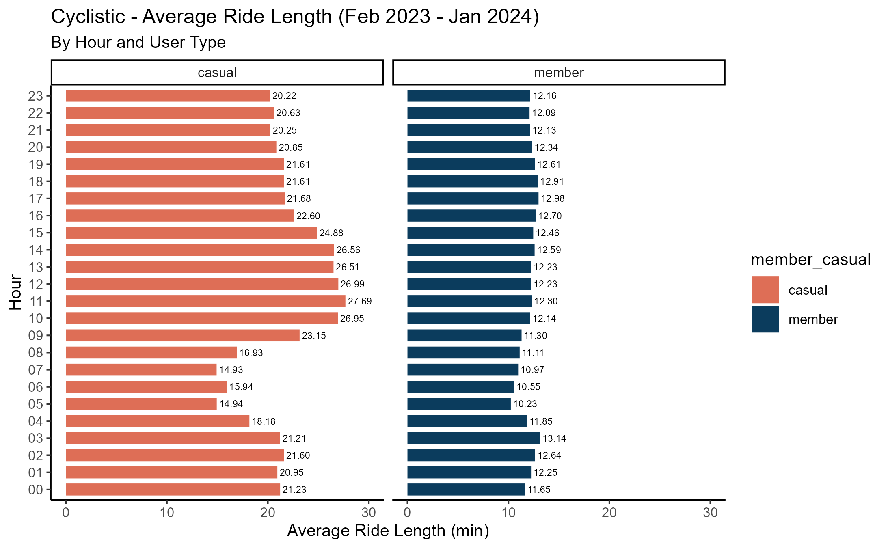

From the graph, it could be noticed that:

- The average ride length of casual riders was significantly longer than that of member riders, with the difference being particularly pronounced during midday hours.
- For casual users, there was a noticeable increase in ride length during the midday hours, particularly from 10 AM to 3 PM.
- For member users, the average ride length was shorter and more consistent throughout the day, fluctuating between 10.23 minutes and 13.14 minutes.

**Analysis of Round-trip and One-way Routes by User Type**

```r
final_data %>%
  group_by(member_casual, round_trip) %>% 
  summarise(total_rides = length(round_trip),
            average_ride_length = round(mean(ride_length), digits = 2))
```

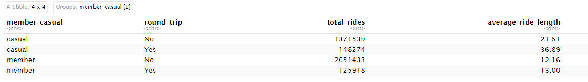

Findings from the data: 

- The total number of rides on one-way routes was more than round-trip routes for both riders while the average ride length for round-trip routes was longer than for one-way routes.

**Analysis of Top 10 Most Frequent Routes by User Type** 

```r
final_data <- final_data %>%
  mutate(route = paste(start_station_name, "->", end_station_name))

# group by the new route column, filter for list of top 10 routes 
top_routes_member <- final_data %>%
  filter(member_casual == "casual") %>%
  group_by(route, member_casual, round_trip) %>%
  summarize(number_of_ride = n()) %>%
  ungroup() %>%
  arrange(desc(number_of_ride)) %>% 
  slice_max(order_by = number_of_ride, n = 10)

# plot the top 10 routes
ggplot(top_routes_member, aes(x = reorder(route, number_of_ride), y = number_of_ride, fill = round_trip)) +
geom_bar(stat = "identity", position = position_dodge(preserve = 'single'), width = 0.5) +
  geom_text(aes(label = format(number_of_ride, big.mark = ",")), position = position_dodge(width = 0.7), hjust = -0.1, size = 1.7) + 
  
  labs(x = "Route", y = "Number of Rides", 
       title = "Cyclistic - Top 10 Most Frequent Routes", 
       subtitle =  "For Casual Users") +
  scale_fill_manual(values = c("#c1c1f3","#ffd1dc")) +
  scale_y_continuous(labels = scales::comma_format(), limits = c(0,10000)) +
  theme_classic(base_size = 10) + 
  theme(axis.text.y = element_text(size = 6)) + 
  coord_flip()

ggsave("Top_10_Most_Frequent_Routes_For_Casual_Users.png", plot = last_plot(), dpi = 300)
```

```r
final_data <- final_data %>%
  mutate(route = paste(start_station_name, "->", end_station_name))

# group by the new route column, filter for list of top 10 routes 
top_routes_member <- final_data %>%
  filter(member_casual == "member") %>%
  group_by(route, member_casual, round_trip) %>%
  summarize(number_of_ride = n()) %>%
  ungroup() %>%
  arrange(desc(number_of_ride)) %>% 
  slice_max(order_by = number_of_ride, n = 10)

# plot the top 10 routes
ggplot(top_routes_member, aes(x = reorder(route, number_of_ride), y = number_of_ride, fill = round_trip)) +
geom_bar(stat = "identity", position = position_dodge(preserve = 'single'), width = 0.5) +
  geom_text(aes(label = format(number_of_ride, big.mark = ",")), position = position_dodge(width = 0.7), hjust = -0.1, size = 1.7) + 
  
  labs(x = "Route", y = "Number of Rides", 
       title = "Cyclistic - Top 10 Most Frequent Routes", 
       subtitle =  "For Member Users") +
  scale_fill_manual(values = c("#c1c1f3","#ffd1dc")) +
  scale_y_continuous(labels = scales::comma_format(), limits = c(0,10000)) +
  theme_classic(base_size = 10) + 
  theme(axis.text.y = element_text(size = 6)) + 
  coord_flip()

ggsave("Top_10_Most_Frequent_Routes_For_Member_Users.png", plot = last_plot(), dpi = 300)
```
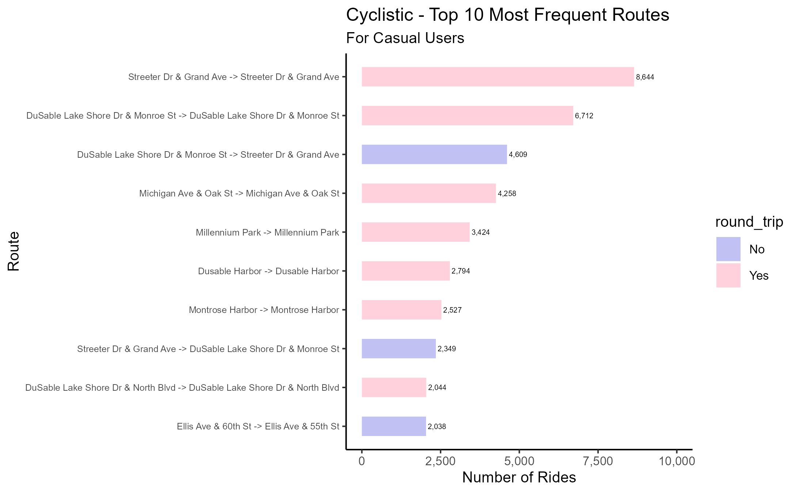

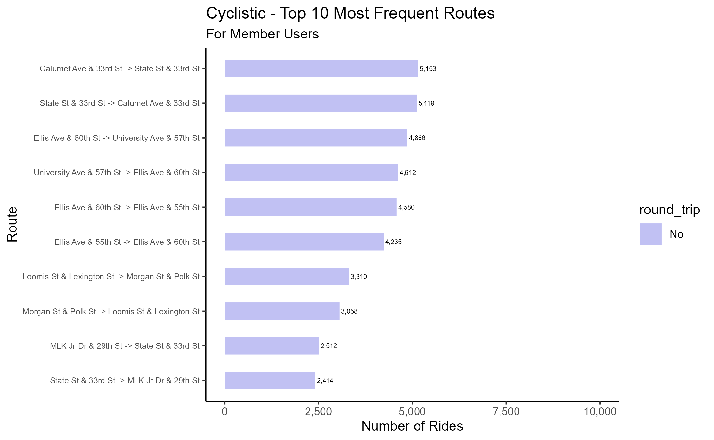


As can be discovered from the graph of top 10 most frequent routes for each user: 

- Round-trip routes were predominant among casual riders, accounting for 7 out of 10 routes.
- There was only one common route for both groups, which was from *Ellis Ave & 55th St to Ellis Ave & 60 St.*
- Number of rides for member users were more evenly distributed compared to casual riders.
    - Member riders ranged from around 2,500 to just over 5,000, with the most frequently used route being a one-way trip.
    - Casual riders saw greater variability with the total rides fluctuating from about 2,000 to over 8,000 and the most popular route was a round trip.

**Summary** 

Below are some insights and trends I have gained from the analysis that can be useful when design marketing strategies aimed at converting casual riders into annual members. 

- The **most popular bike** among all users was **classic**.
- The **high season** for **both types of users** was from **May to October**.
- **Members** tended to be more active on **weekdays**, whereas **casuals** used the bikes more frequently on **weekends**.
- **Busiest hours** for **both member and user** riders were **between 4 PM and 6 PM.**
- **Casual users** **travelled longer distance** than members throughout the whole week. The average ride length of casual riders was 10.8 minutes longer than members riders.
- The **total rides on one-way routes outnumbered** those for round-trip routes for **both types of users**.

## **STEP 6: ACT**

Below are my recommendations to help convert the casual riders into annual members. 

1. Offering promotional incentives, discount rates or trial memberships during the off-peak season from December to February. 
2. Implementing some exclusive benefits specifically for membership during the peak hours (4 PM - 6 PM) to enhance user experience and satisfaction levels. There are some benefits that can be put into consideration such as priority access during peak hours, discounts on additional services, loyalty points accumulation program, etc. 
3. Launching a marketing campaign aimed at increasing the usage of classic bikes among both casual and member riders.

---

*This comes to the end of my first capstone project in data analytics. You can view my full code on my Github for this project [here](https://github.com/alitanguyen/Cyclistic-bike-share-analysis/tree/main).* 

*If you have any comments or suggestions, please feel free to let me know. Thank you for reading my analysis!* 

